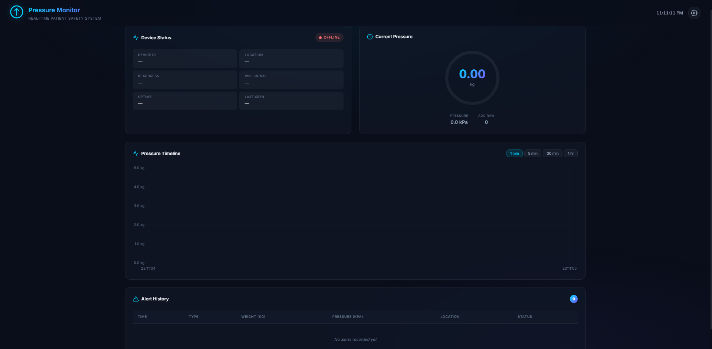
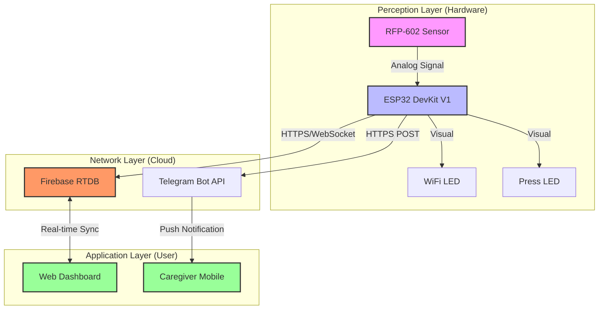

<div align="center">

# 🩺 PressureCare IoT
### Advanced Patient Bedsore Prevention System

*Real-time pressure monitoring and intelligent alerting for healthcare excellence.*

[](https://www.espressif.com/)
[](https://firebase.google.com/)
[](https://core.telegram.org/bots)
[](LICENSE)

[](https://www.youtube.com/watch?v=9-h01AvK90g)

---


</div>

## 📸 System Preview

<div align="center">
  
</div>

---

## 🌟 The Vision

Patient bedsores (Pressure Ulcers) are a critical challenge in healthcare, often resulting from prolonged pressure on skin surfaces. **PressureCare IoT** addresses this by providing a high-precision, real-time monitoring solution that empowers caregivers with actionable data and instant notifications.

### 🎯 Objectives
- **Precision Monitoring:** High-fidelity pressure tracking on patient beds.
- **Intelligent Response:** Automated Telegram alerts for critical pressure events.
- **Data Analytics:** Comprehensive Web Dashboard for historical trend analysis.

---

## 🚀 Key Capabilities

| Feature | Description |
| :--- | :--- |
| **📊 Real-time Dashboard** | A stunning dark-mode interface with live SVG gauges and dynamic charts. |
| **🚨 Intelligent Alerts** | Dual-mode Telegram notifications: **Abnormal Pressure** and **Sustained Pressure**. |
| **📡 Cloud Integration** | Seamless data synchronization with Firebase Realtime Database. |
| **📶 Smart Connectivity** | Built-in WiFiManager for easy configuration without hardcoding credentials. |
| **📈 Audit Trail** | Full historical logging of every pressure event for medical review. |

---

## 🏗️ System Architecture

Built on a robust **3-Layer IoT Framework**, ensuring scalability and reliability.



### 🛰️ Protocol Stack
- **HTTPS:** Secure data push to Firebase and Telegram.
- **WebSocket:** Instant live updates for the Web Dashboard.
- **UDP (NTP):** Millisecond-accurate time synchronization for logging.

---

## 📟 Project Structure

```bash
PressureCare_IoT/
├── 📟 esp32/            # C++/Arduino Firmware
├── 🔥 firebase/         # Security Rules & Cloud Config
├── 📊 dashboard/        # HTML5/JS Web Interface
├── 📸 Demo/             # Media Assets
└── 🔌 WIRING_DIAGRAM.md  # Technical Schematics
```

---

## ⚡ Quick Start

### 1. Hardware Setup
Connect the **RFP-602** sensor to **GPIO 34** through the conversion module. Ensure you use the **3.3V** rail. (See [Wiring Guide](./WIRING_DIAGRAM.md)).

### 2. Firebase Configuration
1. Create a project at [Firebase Console](https://console.firebase.google.com).
2. Enable **Realtime Database** (Singapore region recommended).
3. Enable **Authentication** (Email/Password).
4. Copy your `API Key` and `Database URL`.

### 3. ESP32 Deployment
1. Open `esp32/esp32_pressure_monitor.ino`.
2. Create `config.h` from the example and paste your credentials.
3. Upload to your ESP32.

### 4. Dashboard Launch
Simply open `dashboard/index.html` in your browser and configure the connection via the settings (⚙️) icon.

---

## 🔌 Hardware Blueprint

### Pin Mapping

| Peripheral | ESP32 Pin | Logic |
| :--- | :--- | :--- |
| **Pressure Sensor (AO)** | **GPIO 34** | ADC1_CH6 |
| **Status LED (Blue)** | **GPIO 18** | WiFi Link |
| **Action LED (Yellow)** | **GPIO 19** | Pressure Event |
| **Reset Button** | **GPIO 0** | Hold 3s to Reset WiFi |

> [!CAUTION]
> Always verify that your sensors are powered by **3.3V**. Connecting to the 5V rail will permanently damage the ESP32 analog pins.

---

## ⚙️ Intelligent Thresholds

The system is fine-tuned for clinical scenarios but can be customized in `config.h`:

| Variable | Default | Purpose |
| :--- | :--- | :--- |
| `PRESSURE_THRESHOLD_KG` | 0.5 kg | Detection sensitivity. |
| `CONTINUOUS_SECONDS` | 10 s | Time before "Sustained Pressure" alert. |
| `ABNORMAL_KG` | 4.5 kg | Instant trigger for extreme pressure. |
| `DATA_INTERVAL` | 2000 ms | Cloud sync frequency. |

---

## 📚 Stack & Security

- **Firmware:** Arduino Core for ESP32, WiFiManager, ArduinoJson.
- **Backend:** Firebase Authentication & Realtime Database.
- **Frontend:** Chart.js, Vanilla JS (ES6+), Glassmorphism CSS.
- **Security:** Authenticated ESP32 writes, Locked Database Rules, Encrypted HTTPS traffic.

---

<div align="center">

**Engineering for a safer healthcare experience.**

Made with ❤️ for Patient Care.

</div>
