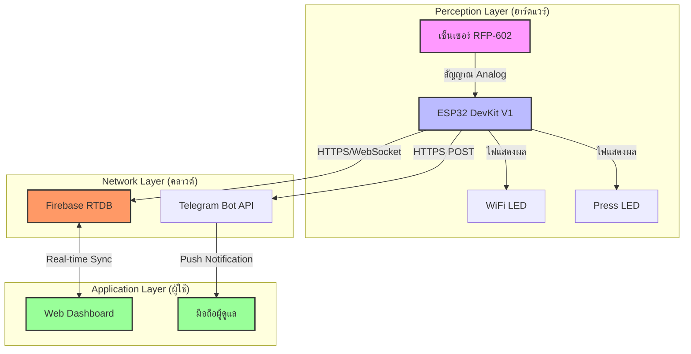

<div align="center">

# 🩺 PressureCare IoT
### ระบบอัจฉริยะสำหรับเฝ้าระวังแผลกดทับผู้ป่วย

*การตรวจจับแรงกดแบบ Real-time และระบบแจ้งเตือนอัจฉริยะ เพื่อยกระดับการดูแลสุขภาพ*

[](https://www.espressif.com/)
[](https://firebase.google.com/)
[](https://core.telegram.org/bots)
[](LICENSE)

[](https://www.youtube.com/watch?v=_hwR8I9PEMo)

---

**[🌐 English Version](./README.md)**

</div>

## 📸 ตัวอย่างระบบ

<div align="center">
  
</div>

---

## 🌟 วิสัยทัศน์ของโครงการ

แผลกดทับ (Pressure Ulcers) เป็นปัญหาสำคัญในการดูแลผู้ป่วยติดเตียง ซึ่งเกิดจากแรงกดทับเป็นเวลานาน **PressureCare IoT** ถูกพัฒนาขึ้นเพื่อแก้ปัญหานี้ด้วยระบบตรวจจับที่มีความแม่นยำสูง ส่งข้อมูลแบบ Real-time เพื่อให้ผู้ดูแลสามารถตอบสนองได้อย่างทันท่วงที

### 🎯 วัตถุประสงค์
- **การตรวจจับที่แม่นยำ:** ติดตามแรงกดบนเตียงผู้ป่วยด้วยความละเอียดสูง
- **การตอบสนองอัจฉริยะ:** แจ้งเตือนผ่าน Telegram อัตโนมัติเมื่อเกิดเหตุการณ์วิกฤต
- **การวิเคราะห์ข้อมูล:** แสดงผลผ่าน Web Dashboard เพื่อวิเคราะห์แนวโน้มย้อนหลัง

---

## 🚀 คุณสมบัติเด่น

| คุณสมบัติ | รายละเอียด |
| :--- | :--- |
| **📊 Real-time Dashboard** | อินเตอร์เฟซแบบ Dark Mode ที่สวยงาม พร้อม Gauge และกราฟที่อัปเดตสดใหม่ |
| **🚨 การแจ้งเตือนอัจฉริยะ** | แจ้งเตือน 2 รูปแบบ: **แรงกดผิดปกติ** และ **แรงกดค้างนานเกินกำหนด** |
| **📡 เชื่อมต่อ Cloud** | ซิงค์ข้อมูลกับ Firebase Realtime Database ได้อย่างไร้รอยต่อ |
| **📶 ระบบ WiFi อัจฉริยะ** | มี WiFiManager ในตัว ตั้งค่า WiFi ได้ง่ายผ่านมือถือโดยไม่ต้องแก้โค้ด |
| **📈 บันทึกประวัติ** | เก็บประวัติการแจ้งเตือนทั้งหมดเพื่อใช้ในการวินิจฉัยทางการแพทย์ |

---

## 🏗️ สถาปัตยกรรมระบบ

ออกแบบตามโครงสร้าง **IoT 3-Layer Framework** เพื่อความเสถียรและรองรับการขยายตัว



### 🛰️ โปรโตคอลที่ใช้
- **HTTPS:** ส่งข้อมูลไปยัง Firebase และ Telegram อย่างปลอดภัย
- **WebSocket:** อัปเดตข้อมูลบน Dashboard แบบทันที
- **UDP (NTP):** ซิงค์เวลาที่แม่นยำระดับมิลลิวินาทีสำหรับการบันทึก Log

---

## 📟 โครงสร้างโปรเจค

```bash
PressureCare_IoT/
├── 📟 esp32/            # ซอร์สโค้ดสำหรับ ESP32 (Arduino)
├── 🔥 firebase/         # การตั้งค่าความปลอดภัยและคลาวด์
├── 📊 dashboard/        # ส่วนแสดงผลบนเว็บ (HTML5/JS)
├── 📸 Demo/             # รูปภาพและวิดีโอสาธิต
└── 🔌 WIRING_DIAGRAM.md  # ผังการต่อวงจร
```

---

## ⚡ เริ่มต้นใช้งานอย่างรวดเร็ว

### 1. การเตรียมฮาร์ดแวร์
ต่อเซ็นเซอร์ **RFP-602** เข้ากับขา **GPIO 34** ผ่านโมดูลแปลงสัญญาณ ตรวจสอบให้แน่ใจว่าใช้ไฟ **3.3V** (ดู [คู่มือการต่อสาย](./WIRING_DIAGRAM.md))

### 2. ตั้งค่า Firebase
1. สร้างโปรเจคที่ [Firebase Console](https://console.firebase.google.com)
2. เปิดใช้งาน **Realtime Database** (แนะนำโซน Singapore)
3. เปิดใช้งาน **Authentication** (แบบ Email/Password)
4. คัดลอก `API Key` และ `Database URL` มาเตรียมไว้

### 3. ติดตั้งโปรแกรมลง ESP32
1. เปิดไฟล์ `esp32/esp32_pressure_monitor.ino`
2. สร้างไฟล์ `config.h` จากไฟล์ตัวอย่างแล้วใส่ค่าที่เตรียมไว้
3. อัปโหลดโค้ดลงบอร์ด ESP32

### 4. เปิดใช้งาน Dashboard
เปิดไฟล์ `dashboard/index.html` ด้วยเบราว์เซอร์ และตั้งค่าการเชื่อมต่อผ่านไอคอนฟันเฟือง (⚙️)

---

## 🔌 ผังการเชื่อมต่อขา (Pin Mapping)

| อุปกรณ์ | ขา ESP32 | หน้าที่ |
| :--- | :--- | :--- |
| **เซ็นเซอร์แรงกด (AO)** | **GPIO 34** | อ่านค่า Analog (ADC) |
| **ไฟสถานะ (สีฟ้า)** | **GPIO 18** | สถานะ WiFi |
| **ไฟแจ้งเตือน (สีเหลือง)** | **GPIO 19** | เมื่อมีแรงกด |
| **ปุ่มรีเซ็ต** | **GPIO 0** | กดค้าง 3 วินาทีเพื่อล้างค่า WiFi |

> [!CAUTION]
> ตรวจสอบเสมอว่าเซ็นเซอร์ใช้ไฟ **3.3V** การต่อไฟ 5V เข้าขา Analog ของ ESP32 อาจทำให้บอร์ดเสียหายถาวร

---

## ⚙️ การตั้งค่าระบบ (Thresholds)

คุณสามารถปรับแต่งค่าต่างๆ ได้ในไฟล์ `config.h`:

| ตัวแปร | ค่าเริ่มต้น | คำอธิบาย |
| :--- | :--- | :--- |
| `PRESSURE_THRESHOLD_KG` | 0.5 kg | ความไวในการตรวจจับ |
| `CONTINUOUS_SECONDS` | 10 s | เวลากดค้างก่อนแจ้งเตือน (โหมดสาธิต) |
| `ABNORMAL_KG` | 4.5 kg | แจ้งเตือนทันทีเมื่อแรงกดสูงเกินไป |
| `DATA_INTERVAL` | 2000 ms | ความถี่ในการส่งข้อมูลขึ้นคลาวด์ |

---

## 📚 เทคโนโลยีและความปลอดภัย

- **Firmware:** Arduino Core for ESP32, WiFiManager, ArduinoJson
- **Backend:** Firebase Authentication & Realtime Database
- **Frontend:** Chart.js, Vanilla JS (ES6+), Glassmorphism CSS
- **Security:** การเขียนข้อมูลแบบระบุตัวตน, กฎฐานข้อมูลที่เข้มงวด, รับส่งข้อมูลผ่าน HTTPS

---

<div align="center">

**วิศวกรรมเพื่อประสบการณ์การดูแลสุขภาพที่ปลอดภัยยิ่งขึ้น**

สร้างด้วย ❤️ เพื่อการดูแลผู้ป่วย

</div>
